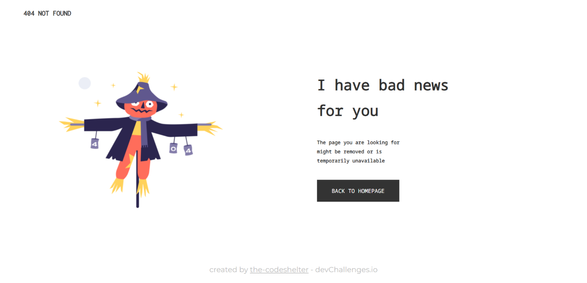

<!-- Please update value in the {}  -->

<h1 align="center">{The 404 Not Found Page}</h1>

   Solution for a challenge from  <a href="http://devchallenges.io" target="_blank">Devchallenges.io</a>.

  <h3>
    <a href="https://the-codeshelter.github.io">
      Demo
    </a>
     | 
    <a href="https://github.com/the-codeshelter/404-not-found">
      Solution
    </a>
     | 
    <a href="https://devchallenges.io/challenges/wBunSb7FPrIepJZAg0sY">
      Challenge
    </a>
  </h3>

<!-- TABLE OF CONTENTS -->

## Table of Contents

-   [Overview](#overview)
    -   [Built With](#built-with)
-   [Features](#features)
-   [Contact](#contact)
-   [Acknowledgements](#acknowledgements)

<!-- OVERVIEW -->

## Overview

\*Demo link on top of the page

This is the first step to learn deeper about responsive web development. I learned that it is really important for a website to be responsive because it is accessed from devices with various screen width. The 404 not found page helps building a better user experience (UX) in a website. And also, from what I know, the 404 not found page also prevents clients from seeing server side errors. I'm happy to learn and would be willing to face more challenges in [devchallenges.io](https://devchallenges.io).

### Built With

<!-- This section should list any major frameworks that you built your project using. Here are a few examples.-->

-   HTML
-   CSS
-   Fonts from [Google Fonts](https://fonts.google.com/)
    -   [Inconsolata](https://fonts.google.com/specimen/Inconsolata)
    -   [Noto Sans Mono](https://fonts.google.com/noto/specimen/Noto+Sans+Mono)
    -   [Montserrat](https://fonts.google.com/specimen/Montserrat)

## Features

<!-- List the features of your application or follow the template. Don't share the figma file here :) -->

This application/site was created as a submission to a [DevChallenges](https://devchallenges.io/challenges) challenge. The [challenge](https://devchallenges.io/challenges/wBunSb7FPrIepJZAg0sY) was to build a 404 not found page with the assets given.

## Acknowledgements

<!-- This section should list any articles or add-ons/plugins that helps you to complete the project. This is optional but it will help you in the future. For exmpale -->

-   [Steps to replicate a design with only HTML and CSS](https://devchallenges-blogs.web.app/how-to-replicate-design/)
-   [Body not on top of the page (Stackoverflow)](https://stackoverflow.com/questions/19080185/html-body-is-not-at-the-top-of-the-page-even-with-margin-set-to-0)
-   [Footer on bottom of the page (Stackoverflow)](https://stackoverflow.com/questions/34796085/how-to-stick-footer-to-bottom-not-fixed-even-with-scrolling/34796186)

## Contact

-   GitHub [@the-codeshelter](https://github.com/the-codeshelter)
